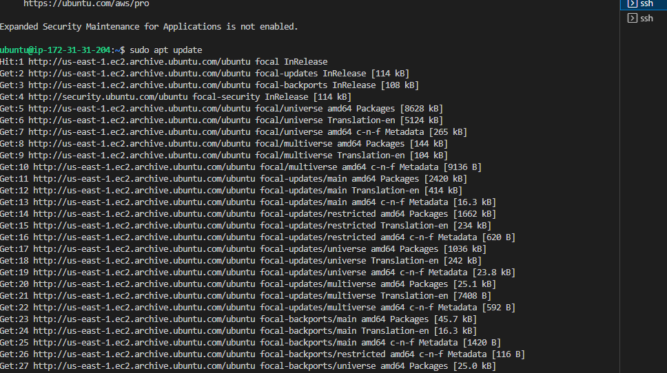
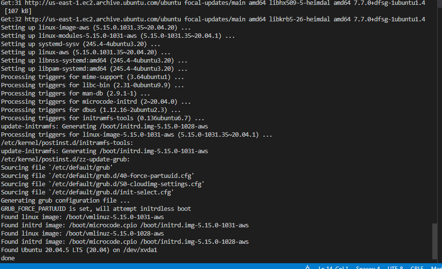
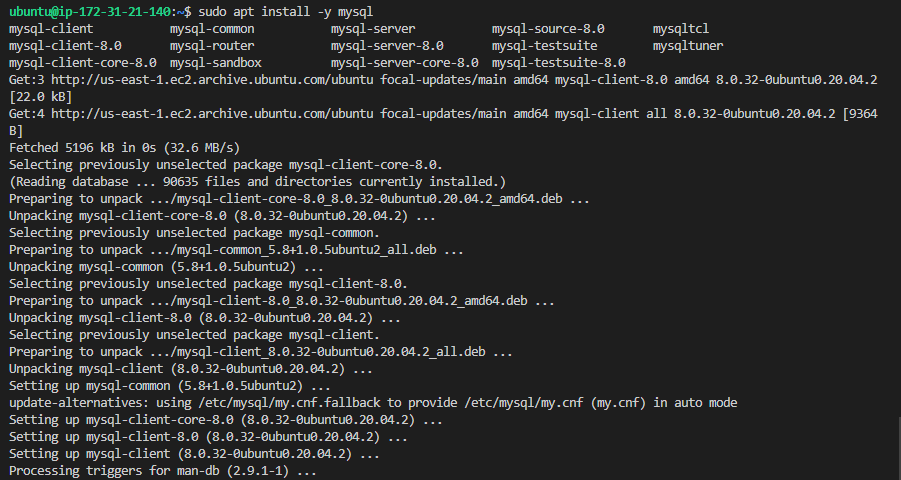
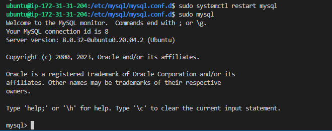
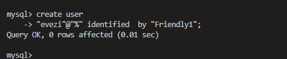
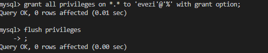
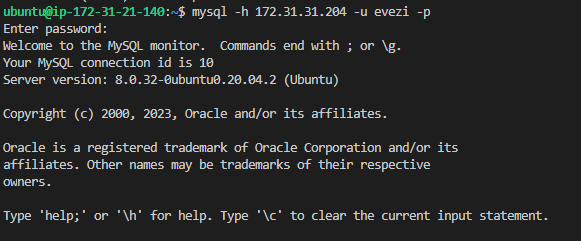
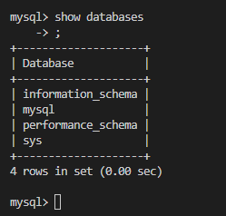

## Documentation for Project 5
## IMPLEMENT A CLIENT SERVER ARCHITECTURE USING MYSQL DATABASE MANAGEMENT SYSTEM (DBMS)

## STEP 1 — CLIENT SERVER ARCHITECTURE WITH MYSQL

-- Starting by spinning up two EC2 instance server labelled "Projec 5 - MySQL Server" and "Projec 5 - MySQL Client" from my local windows terminal.

`sudo apt update`--(Running command  in both instance MYSQL Server and MySQL Client  ubuntu server to update my list of packages in Ubuntu package manager)

`sudo apt upgrade`--(running command in both instance MYSQL Server and MySQL Client  ubuntu server to upgrade to lastest list of packages in Ubuntu package manager)

`sudo apt install -y mysql-server`--(Install MYSQL Server software to my Mysql server linux instance)

`sudo apt install -y mysql-client`--(Install MYSQL client software to my Mysql client linux instance)

`vi myqsld.cnf`--(In vi text editor configure mysqld.cnf file by replacing Bind Address ‘127.0.0.1’ to ‘0.0.0.0' in my Mysql shell for mysql server)

`sudo systemctl restart mysql`; `sudo mysql`--(1.Restart mysql database to add all changes to my mysql server. 2. login to mysql shell in my mysql server terminal)

`create user "evezi"@"%" identified by "Friendly1";`--(Create username and password for my mysql database)

`grant all privileges on *.* to 'evezi'@'%' with grant option;`--(Grant all privileges on mysql server to root user)

`flush privilages;`--(Update all changes to database)

`mysql -h 172.31.31.204 evezi -p`--(Use mysql server's local IP address to connect remotely from mysql client Linux Server to mysql server Database Engine without using SSH)

`Show database`--(Successfully connected to a remote MySQL server and can perform SQL queries. Display table in mysql server database from mysql client Linux Server)

